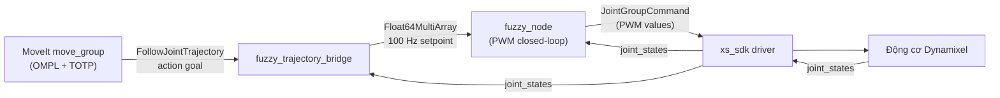

# Báo cáo: Tích hợp MoveIt với Fuzzy PWM Controller cho rx150

## 1. Mục tiêu

Tạo một **bridge node** cho phép MoveIt (planning OMPL + Time-Optimal Trajectory Parameterization) điều khiển cánh tay rx150 thông qua bộ điều khiển fuzzy PWM, thay vì ros2_control `JointTrajectoryController` position mode thông thường.

## 2. Kiến trúc hệ thống



**Luồng dữ liệu:**
1. Người dùng chọn pose trong **RViz MotionPlanning** → **Plan & Execute**
2. `move_group` plan trajectory (OMPL) rồi gửi `FollowJointTrajectory` action goal tới bridge
3. Bridge **nội suy tuyến tính** trajectory theo thời gian thực, stream setpoint 100 Hz
4. `fuzzy_node` nhận setpoint, tính sai số e = setpoint − vị trí thực, áp dụng bộ fuzzy logic ra PWM
5. PWM được gửi xuống `xs_sdk` → Dynamixel motors

## 3. Danh sách file thay đổi

| Loại | File | Mô tả |
|------|------|-------|
| **MỚI** | [fuzzy_trajectory_bridge](file:///home/hust/interbotix_ws/src/fuzzy_controller/scripts/fuzzy_trajectory_bridge) | Bridge node Python — action server + nội suy + stream |
| **MỚI** | [fuzzy_moveit.launch.py](file:///home/hust/interbotix_ws/src/fuzzy_controller/launch/fuzzy_moveit.launch.py) | Launch file tích hợp 5 thành phần |
| **SỬA** | [CMakeLists.txt](file:///home/hust/interbotix_ws/src/fuzzy_controller/CMakeLists.txt) | Thêm bridge vào install scripts |
| **SỬA** | [package.xml](file:///home/hust/interbotix_ws/src/fuzzy_controller/package.xml) | Thêm 7 exec_depend |

---

## 4. Chi tiết từng file

### 4.1. [MỚI] `scripts/fuzzy_trajectory_bridge` (283 dòng)

> Node Python/rclpy — `FollowJointTrajectory` action server làm cầu nối MoveIt → fuzzy_node.

**Đặc điểm chính:**

| Thành phần | Chi tiết |
|------------|----------|
| Action server | `arm_controller/follow_joint_trajectory` (ns `rx150` → `/rx150/arm_controller/follow_joint_trajectory`) |
| Publisher | `fuzzy/setpoint` (`Float64MultiArray`, 5 giá trị theo thứ tự `[waist, shoulder, elbow, wrist_angle, wrist_rotate]`) |
| Subscriber | `joint_states` (`JointState`) — đọc vị trí thực để kiểm tra tolerance cuối |
| Executor | `MultiThreadedExecutor` (4 threads) + `ReentrantCallbackGroup` — action execute không block joint_states subscriber |
| Parameters | `setpoint_rate` (100.0 Hz), `default_goal_tolerance` (0.02 rad), `goal_time_margin` (0.5 s) |

**Thuật toán `execute_callback`:**

```
1. Validate joint_names ⊆ ARM_JOINTS (5 khớp arm)
2. Build index map: thứ tự khớp trong trajectory → thứ tự chuẩn arm
3. Vòng lặp 100 Hz:
   a. Kiểm tra cancel / preempt
   b. Tính elapsed time
   c. Nội suy tuyến tính giữa 2 điểm trajectory liền kề
   d. Publish Float64MultiArray setpoint
   e. Publish feedback (desired, actual, error)
   f. Break khi elapsed ≥ duration + goal_time_margin
4. Kiểm tra goal tolerance:
   - So sánh vị trí thực (joint_states) với điểm cuối trajectory
   - Nếu tất cả sai số < tolerance → SUCCEEDED
   - Ngược lại → GOAL_TOLERANCE_VIOLATED
```

**Xử lý an toàn:**
- Goal mới tự động preempt (abort) goal cũ
- Cancel request được chấp nhận ngay
- Nếu chưa nhận `joint_states` → trả lỗi thay vì block

---

### 4.2. [MỚI] `launch/fuzzy_moveit.launch.py` (311 dòng)

> Launch file tích hợp, mô phỏng theo `interbotix_xsarm_moveit/launch/xsarm_moveit.launch.py` nhưng thay backend ros2_control bằng fuzzy.

**5 thành phần được launch:**

| # | Node | Package | Vai trò |
|---|------|---------|---------|
| 1 | `xsarm_control` (include) | `interbotix_xsarm_control` | Driver xs_sdk + robot_description + TF |
| 2 | `fuzzy_node` | `fuzzy_controller` | Bộ điều khiển PWM closed-loop |
| 3 | `fuzzy_trajectory_bridge` | `fuzzy_controller` | Action server bridge |
| 4 | `move_group` | `moveit_ros_move_group` | MoveIt planning (OMPL + TOTP) |
| 5 | `rviz2` (tuỳ chọn) | `rviz2` | Giao diện MotionPlanning |

**Điểm khác biệt quan trọng so với `xsarm_moveit.launch.py` gốc:**

```diff
 # trajectory_execution_parameters
-'moveit_manage_controllers': True,
+'moveit_manage_controllers': False,
```

> `moveit_manage_controllers: False` vì không có `controller_manager` của ros2_control. Bridge tự cung cấp action server — MoveIt chỉ cần gửi goal.

**Launch arguments:**

| Argument | Default | Mô tả |
|----------|---------|-------|
| `robot_model` | `rx150` | Model robot |
| `robot_name` | `= robot_model` | Tên robot (namespace) |
| `use_moveit_rviz` | `true` | Bật/tắt RViz |
| `rviz_config_file` | `xsarm_moveit.rviz` | File config RViz |

**Config MoveIt tái sử dụng (không sửa):**
- `rx150_controllers.yaml` — tên action `/rx150/arm_controller/follow_joint_trajectory` khớp sẵn
- `kinematics.yaml`, `ompl_planning.yaml`, `rx150_joint_limits.yaml`
- `xsarm_moveit.rviz`
- Robot description (URDF + SRDF) qua helper `interbotix_xs_modules`

---

### 4.3. [SỬA] `CMakeLists.txt`

```diff
-install(PROGRAMS scripts/fuzzy_gui DESTINATION lib/${PROJECT_NAME})
+install(PROGRAMS scripts/fuzzy_gui scripts/fuzzy_trajectory_bridge DESTINATION lib/${PROJECT_NAME})
```

> Thêm `fuzzy_trajectory_bridge` vào dòng install để colcon copy vào `lib/fuzzy_controller/`.

---

### 4.4. [SỬA] `package.xml`

```diff
   <exec_depend>rclpy</exec_depend>
   <exec_depend>python3-tk</exec_depend>
+  <exec_depend>control_msgs</exec_depend>
+  <exec_depend>trajectory_msgs</exec_depend>
+  <exec_depend>action_msgs</exec_depend>
+  <exec_depend>interbotix_xs_modules</exec_depend>
+  <exec_depend>interbotix_xsarm_moveit</exec_depend>
+  <exec_depend>moveit_ros_move_group</exec_depend>
+  <exec_depend>interbotix_xsarm_control</exec_depend>
   <test_depend>ament_lint_auto</test_depend>
```

| Dependency | Dùng cho |
|------------|----------|
| `control_msgs` | `FollowJointTrajectory` action type (bridge) |
| `trajectory_msgs` | `JointTrajectory` message (bridge) |
| `action_msgs` | Action infrastructure (bridge) |
| `interbotix_xs_modules` | Helper functions cho launch (robot description, SRDF) |
| `interbotix_xsarm_moveit` | Config MoveIt (controllers, kinematics, OMPL, joint_limits, RViz) |
| `moveit_ros_move_group` | `move_group` node |
| `interbotix_xsarm_control` | Driver launch file `xsarm_control.launch.py` |

---

## 5. Files KHÔNG thay đổi

| File | Lý do giữ nguyên |
|------|-------------------|
| `fuzzy_node.cpp / .hpp` | Bridge chỉ stream setpoint qua topic sẵn có |
| `fuzzy_gains.yaml` | Các gain/param giữ nguyên, `enable_profile` là dead code — không xung đột |
| `rx150_fuzzy.yaml` | Motor config không đổi |
| `rx150_controllers.yaml` (MoveIt) | Tên action đã khớp sẵn với bridge |
| Tất cả config `interbotix_xsarm_moveit` | Tái sử dụng nguyên bản |

---

## 6. Build & Xác nhận

```bash
$ colcon build --packages-select fuzzy_controller
# Summary: 1 package finished [0.90s] ✅
```

**Kiểm tra cài đặt:**

| Kiểm tra | Kết quả |
|----------|---------|
| `ros2 pkg prefix fuzzy_controller` | `/home/hust/interbotix_ws/install/fuzzy_controller` ✅ |
| Launch files | `fuzzy_control.launch.py`, `fuzzy_moveit.launch.py`, `fuzzy_plot.launch.py` ✅ |
| Executables | `fuzzy_gui`, `fuzzy_node`, `fuzzy_trajectory_bridge` ✅ |

---

## 7. Hướng dẫn sử dụng

```bash
# 1. Source workspace
source ~/interbotix_ws/install/setup.bash

# 2. Launch (cắm robot trước)
ros2 launch fuzzy_controller fuzzy_moveit.launch.py

# 3. Xác minh action server
ros2 action list
# → /rx150/arm_controller/follow_joint_trajectory

# 4. Trong RViz: MotionPlanning → Plan & Execute

# 5. Quan sát
ros2 topic echo /rx150/fuzzy/setpoint    # reference streaming
ros2 topic echo /rx150/fuzzy/error       # tracking error
ros2 topic echo /rx150/fuzzy/effort      # PWM output
```

---

## 8. Giới hạn phiên bản v1

> [!NOTE]
> - **Gripper**: MoveIt vẫn list `gripper_controller` nhưng bridge không cung cấp action server cho gripper → lệnh gripper từ RViz sẽ fail. Arm planning (5 khớp) hoạt động đầy đủ.
> - Bridge chỉ phục vụ 5 khớp arm; từ chối trajectory chứa khớp ngoài arm (trả `INVALID_JOINTS`).
> - Nội suy tuyến tính (không cubic spline) — đủ tốt vì TOTP đã parameterize trajectory mịn.
